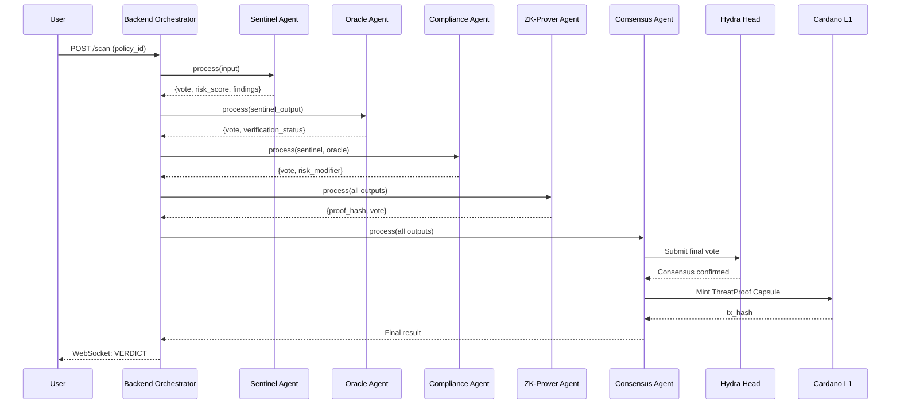

# **Process Flow Diagram – Sentinel Orchestrator Network (SON)**
## **5-Agent Architecture**

Below is the process-flow diagram for the unified 5-Agent Sentinel Orchestrator Network.

---

## **1. High-Level Architecture Flow**

```
                           ┌────────────────────────┐
                           │         User            │
                           │ (Wallet / dApp / Dev)   │
                           └───────────┬────────────┘
                                       │
                         (POST /api/v1/scan with Policy ID)
                                       │
                                       ▼
                     ┌──────────────────────────────────┐
                     │     Backend Orchestrator         │
                     │  (FastAPI + ThreatDetectionCrew) │
                     └───────────┬──────────────────────┘
                                 │
                    (CrewAI Sequential Workflow)
                                 │
                                 ▼
       ┌────────────────────────────────────────────────────────┐
       │                   5-Agent Pipeline                     │
       │                                                        │
       │  ┌──────────┐   ┌──────────┐   ┌──────────┐           │
       │  │ Sentinel │ → │  Oracle  │ → │Compliance│           │
       │  │ Agent A  │   │ Agent B  │   │ Agent C  │           │
       │  └──────────┘   └──────────┘   └──────────┘           │
       │       │              │              │                  │
       │       └──────────────┴──────────────┘                  │
       │                      │                                 │
       │                      ▼                                 │
       │              ┌──────────────┐                          │
       │              │  ZK-Prover   │                          │
       │              │   Agent D    │                          │
       │              └──────┬───────┘                          │
       │                     │                                  │
       │                     ▼                                  │
       │              ┌──────────────┐                          │
       │              │  Consensus   │                          │
       │              │   Agent E    │                          │
       │              └──────────────┘                          │
       └────────────────────┬───────────────────────────────────┘
                            │
                            │ (Submit final vote)
                            ▼
     ┌──────────────────────────────────────────────────────────┐
     │                Hydra Head Consensus Layer                │
     │         (Fast Off-Chain Voting, < 1 second)              │
     └───────────────────┬──────────────────────────────────────┘
                         │
                         │ (Mint ThreatProof Capsule)
                         ▼
           ┌─────────────────────────────────────────┐
           │         Cardano L1 (Plutus)             │
           │   ThreatProof Capsule Registry (CIP-25) │
           └───────────────────┬─────────────────────┘
                               │
                     (Query / Verification)
                               ▼
               ┌────────────────────────────────┐
               │       Frontend Dashboard       │
               │   (Real-time WebSocket Feed)   │
               └────────────────────────────────┘
```

---

## **2. Agent Workflow Detail**

```
┌─────────────────────────────────────────────────────────────────────────────┐
│                         5-AGENT SEQUENTIAL WORKFLOW                         │
└─────────────────────────────────────────────────────────────────────────────┘

    ┌────────────────────┐
    │   AGENT A: Sentinel │ ────────────────────────────────────┐
    │   (expert_detector) │                                     │
    │                     │                                     │
    │ • Fetch contract    │                                     │
    │ • Regex patterns    │                                     │
    │ • Risk score 0-100  │                                     │
    │ • Evidence hash     │                                     │
    │ • Vote: SAFE/WARN/  │                                     │
    │        DANGER       │                                     │
    └──────────┬──────────┘                                     │
               │                                                │
               ▼                                                │
    ┌────────────────────┐                                      │
    │   AGENT B: Oracle   │                                     │
    │ (external_verifier) │                                     │
    │                     │                                     │
    │ • Query DEX APIs    │                                     │
    │ • Holder distrib.   │                                     │
    │ • Trading volume    │                                     │
    │ • CONFIRM/DENY/     │                                     │
    │   UNCERTAIN         │                                     │
    └──────────┬──────────┘                                     │
               │                                                │
               ▼                                                │
    ┌────────────────────┐                                      │
    │  AGENT C: Compliance│                                     │
    │ (compliance_checker)│                                     │
    │                     │                                     │
    │ • Sanctions check   │                                     │
    │ • Wallet age/behav. │                                     │
    │ • Risk modifier     │                                     │
    │   (0.5 - 2.0)       │                                     │
    └──────────┬──────────┘                                     │
               │                                                │
               ▼                                                │
    ┌────────────────────┐                                      │
    │  AGENT D: ZK-Prover │                                     │
    │ (privacy_guardian)  │                                     │
    │                     │                                     │
    │ • Generate ZK proof │                                     │
    │ • Midnight compat.  │                                     │
    │ • Privacy-preserv.  │                                     │
    │ • proof_hash        │                                     │
    └──────────┬──────────┘                                     │
               │                                                │
               ▼                                                │
    ┌────────────────────┐       ┌─────────────────────────────┐
    │  AGENT E: Consensus │ ───▶ │        Hydra Head           │
    │ (consensus_mediator)│      │   (L2 Consensus Layer)      │
    │                     │      └──────────────┬──────────────┘
    │ • Aggregate votes   │                     │
    │ • Weighted scoring  │                     ▼
    │ • Final verdict     │      ┌─────────────────────────────┐
    │ • Build CIP-25      │      │       Cardano L1            │
    │   capsule metadata  │      │  ThreatProof Capsule NFT    │
    └─────────────────────┘      └─────────────────────────────┘
```

---

## **3. Vote Weight Distribution**

```
    ┌─────────────────────────────────────────────────────────────┐
    │                    VOTE AGGREGATION                         │
    └─────────────────────────────────────────────────────────────┘

    Agent A (Sentinel)     ████████████████████░░░░░░░░░░  40%
    Agent B (Oracle)       ██████████████░░░░░░░░░░░░░░░░  25%
    Agent C (Compliance)   ████████████░░░░░░░░░░░░░░░░░░  20%
    Agent D (ZK-Prover)    ██████░░░░░░░░░░░░░░░░░░░░░░░░  15%
                           ─────────────────────────────── 
                                                    Total: 100%

    VERDICT THRESHOLDS:
    ┌──────────────┬────────────┬─────────────────────────────────┐
    │ Score Range  │  Verdict   │  UI Display                     │
    ├──────────────┼────────────┼─────────────────────────────────┤
    │    0 - 40    │   SAFE     │  🟢 Green shield, "Verified"    │
    │   41 - 70    │  WARNING   │  🟡 Yellow alert, "Caution"     │
    │   71 - 100   │  DANGER    │  🔴 Red skull, "Threat Found"   │
    └──────────────┴────────────┴─────────────────────────────────┘
```

---

## **4. Data Flow Between Agents**

```
┌─────────────────────────────────────────────────────────────────────────────┐
│                           DATA FLOW DIAGRAM                                 │
└─────────────────────────────────────────────────────────────────────────────┘

   User Request                    CrewAI Orchestration
   ───────────                    ────────────────────
        │
        │  {policy_id, scan_depth}
        ▼
   ┌─────────┐   sentinel_output    ┌─────────┐   oracle_output
   │Sentinel │ ─────────────────▶  │ Oracle  │ ────────────────▶
   │   (A)   │                      │   (B)   │
   └─────────┘                      └─────────┘
        │                                │
        │  • risk_score                  │  • verification_status
        │  • findings[]                  │  • liquidity_score
        │  • evidence_hash               │  • holder_data
        │  • vote                        │  • vote
        │                                │
        ▼                                ▼
   ┌────────────┐  compliance_output  ┌──────────┐  zk_prover_output
   │ Compliance │ ──────────────────▶ │ZK-Prover │ ───────────────▶
   │    (C)     │                     │   (D)    │
   └────────────┘                     └──────────┘
        │                                  │
        │  • sanctions_match               │  • proof_hash
        │  • risk_modifier                 │  • verification_key
        │  • wallet_indicators             │  • vote
        │  • vote                          │
        │                                  │
        └──────────────┬───────────────────┘
                       │
                       ▼  ALL 4 OUTPUTS
                  ┌──────────┐
                  │Consensus │
                  │   (E)    │
                  └────┬─────┘
                       │
                       │  • final_verdict
                       │  • final_score
                       │  • capsule_metadata
                       │  • hydra_tx_id
                       │  • l1_tx_id
                       │
                       ▼
              ┌─────────────────┐
              │ ThreatProof     │
              │ Capsule (CIP-25)│
              └─────────────────┘
```

---

## **5. Masumi Payment Flow**

```
┌─────────────────────────────────────────────────────────────────────────────┐
│                         MASUMI PAYMENT FLOW                                 │
└─────────────────────────────────────────────────────────────────────────────┘

    User                    Masumi                    Agents
    ────                    ──────                    ──────
      │                        │                         │
      │  1. Submit scan        │                         │
      │ ──────────────────────▶│                         │
      │                        │                         │
      │  2. Create escrow      │                         │
      │ ◀──────────────────────│                         │
      │                        │                         │
      │  3. Deposit funds      │                         │
      │ ──────────────────────▶│                         │
      │                        │                         │
      │                        │  4. Dispatch tasks      │
      │                        │ ────────────────────────▶
      │                        │                         │
      │                        │  5. Agent A completes   │
      │                        │ ◀────────────────────────
      │                        │  → Micropayment (40%)   │
      │                        │                         │
      │                        │  6. Agent B completes   │
      │                        │ ◀────────────────────────
      │                        │  → Micropayment (25%)   │
      │                        │                         │
      │                        │  7. Agent C completes   │
      │                        │ ◀────────────────────────
      │                        │  → Micropayment (20%)   │
      │                        │                         │
      │                        │  8. Agent D completes   │
      │                        │ ◀────────────────────────
      │                        │  → Micropayment (15%)   │
      │                        │                         │
      │  9. Final result       │                         │
      │ ◀──────────────────────│                         │
      │                        │                         │
```

---

## **6. Use-Case Diagram**

```
┌─────────────────────────────────────────────────────────────────────────────┐
│                         USE-CASE DIAGRAM                                    │
└─────────────────────────────────────────────────────────────────────────────┘

    ACTORS:
    ───────
    • User (Wallet / dApp / Developer)
    • Backend Orchestrator (FastAPI)
    • 5 AI Agents (Sentinel, Oracle, Compliance, ZK-Prover, Consensus)
    • Hydra Consensus Layer
    • Cardano L1

    USE CASES:
    ──────────

    User ──────────────────────────┐
                                   ▼
                    (1) Request Threat Scan
                                   │
                                   ▼
                         Backend Orchestrator
                                   │
                    (2) Initialize CrewAI Workflow
                                   │
                                   ▼
                         5-Agent Pipeline
        ┌──────────────────────────┼─────────────────────────────┐
        ▼                          ▼                             ▼
   Sentinel Agent           Oracle Agent              Compliance Agent
  (Analyze contract)    (Verify with DEX)          (Check sanctions)
        │                          │                             │
        └─────────┬───────────────┴───────────────┬──────────────┘
                  ▼                               ▼
            ZK-Prover Agent              Consensus Agent
          (Generate proof)           (Aggregate & finalize)
                                              │
                               (3) Submit to Hydra
                                              │
                                              ▼
                              Hydra Head (L2 Consensus)
                                              │
                               (4) Write to Cardano L1
                                              │
                                              ▼
                              ThreatProof Capsule (CIP-25)
                                              │
                               (5) Display on Dashboard
                                              │
                                              ▼
                              User sees SAFE / WARNING / DANGER
```

---

## **7. Sequence Diagram (Mermaid Format)**



---

If you'd like, I can also create:
- A **state machine diagram** for agent lifecycle
- A **pitch-deck optimized infographic version**
- A **detailed error handling flow**

